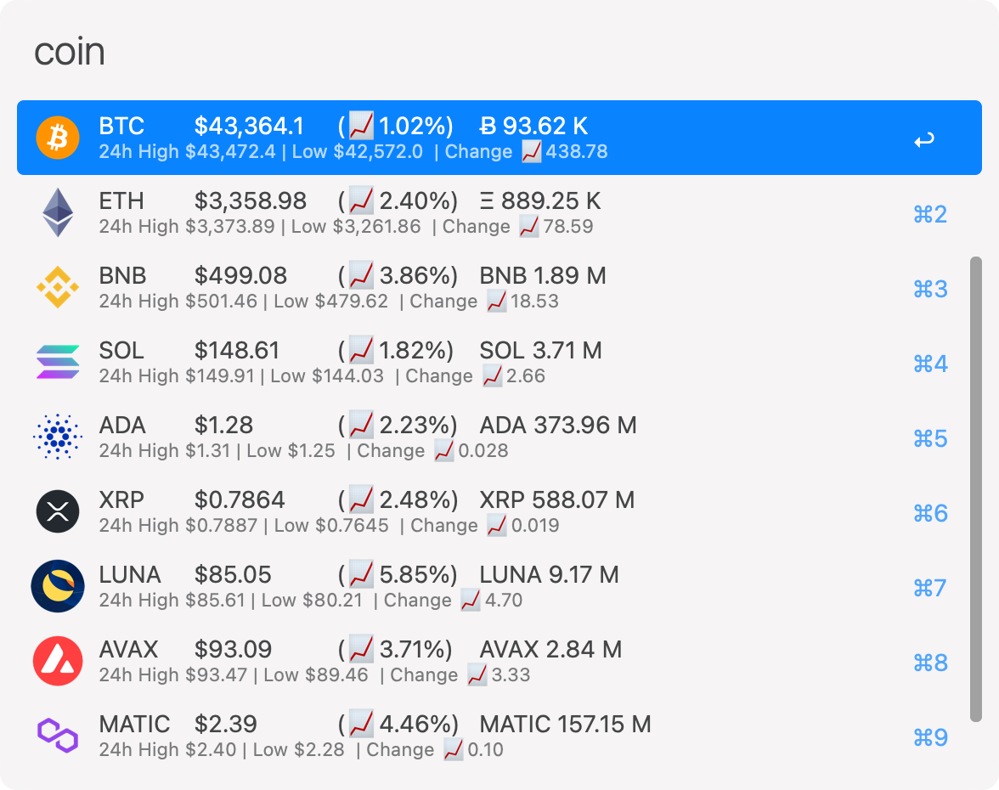

<h1 align="center">
  
   
  Coin Ticker for Alfred Workflow
</h1>

An [Alfred Workflow](http://www.alfredapp.com/) that provides current price 
and status about cryptocurrency from [cryptocompare.com].

Supports Alfred 3 and Alfred 4 on macOS 10.7+ (Python 2.7).

## Install

[Download the latest package][latest release]

## Usage

Simply type `coin` to get the current price of favorite coins.

  

`coin list` shows the current price of the top 10 coins by market cap.

`coin [TICKER]` shows the current price of the coin with that ticker.

`coin add [TICKER] [POSITION(optional)]` adds new coin to the favorites.
Position starts from 1.

`coin remove [TICKER]` removes a coin from the favorites.

`coin set currency [CURRENCY]` sets the fiat currency (3 letters).

`coin reset` resets all settings to default and deletes all caches/saved data.
Please use with caution.

`coin help` shows all available commands.

## Artworks

- All cryptocurrency icons are from [cryptocompare.com]
- App icon https://www.iconfinder.com/icons/2907507/bitcoin_btc_coin_cryptocurrency_icon

## License

The code is released under the MIT license. See [LICENSE](LICENSE) for details.

Awesome [alfred-workflow](https://github.com/deanishe/alfred-workflow) library 
by [@deanishe](https://github.com/deanishe) is also released under 
[MIT License](alfred-workflow/LICENCE.txt).

[cryptocompare.com]: https://www.cryptocompare.com/
[latest release]: https://github.com/bskim45/alfred-coin-ticker/releases/latest/download/alfred-coin-ticker.alfredworkflow
